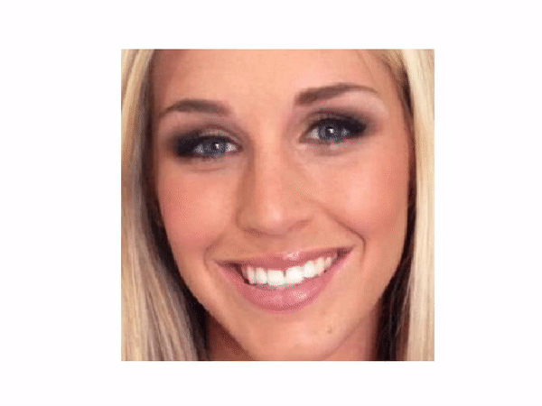
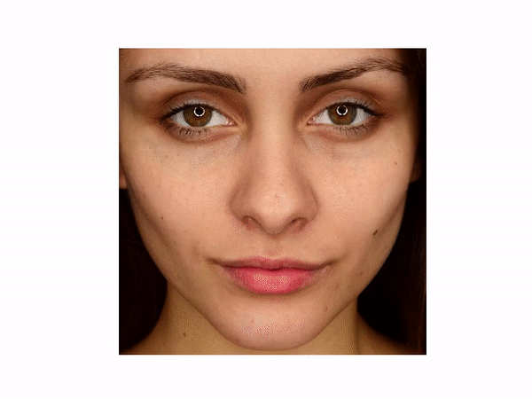

# FaceMorph
Simple Python script that contains functions to morph a picture of one face into a picture of another face.

## How
1. Find [face landmarks](http://blog.dlib.net/2014/08/real-time-face-pose-estimation.html).
2. Map the landmarks points to each other.
3. Find the Delauney triangulation of the landmarks from the source image.
4. For each triangle in the source image, (affine) transform it to its corresponding one in the destination image.
5. You can interpolate how much the face is morphed (0 for no morph, 1 for full morph).

## Can you show me some examples?
Sure:

|      Applying makeup      |       Removing makeup       |
| ------------------------- | --------------------------- |
|  |  |
|  |  |

## Dependencies
You should have `numpy` (for image manipulation) and `cv2` (for triangulation).
Also, `face_recognition` is needed to find the face landmarks (you can use another library if you want).
Please note that `face_recognition` requires `dlib`, which can be annoying to set up.
Finally, `matplotlib` is needed to make the videos in this README.
